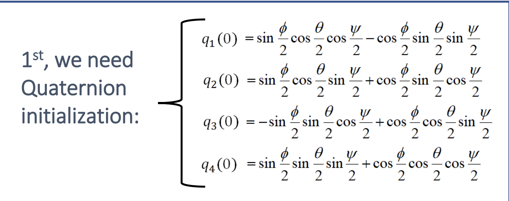

# Research-OSU-IMU-Dev  
**Inertial Measurement Unit Development Using the Kalman Filter**

---

## 📊 Overview

- In drone systems, **Inertial Measurement Units (IMUs)** are critical for **position and attitude determination** (PAD), especially in GPS-denied environments.
- This project aims to design a **lightweight, low-cost IMU** capable of providing reliable orientation and position estimates for **indoor drones**.
- A **Kalman Filter** is used to estimate navigation and attitude parameters: **pitch**, **roll**, **yaw**, and **x, y, z** positions.
- The IMU is built around the **BNO055** sensor, which provides 9 readings: 3-axis linear acceleration, 3-axis angular velocity, and 3-axis magnetometer data.
- My role focuses on the **software development and filtering logic**. I modeled the Kalman Filter in **MATLAB and Simulink**, and am currently porting the system to **Python** for deployment on a custom PCB via USB data streaming.
- This project builds on my background in **calculus**, **object-oriented programming**, and experience with **embedded systems** like the Raspberry Pi and FPV drone hardware.

---

## Kalman Filter Implementation in Python and Matlab
- [Python Code](https://github.com/dchavan2192/Research-OSU-IMU-Dev/blob/main/liveKalman.py)
- [Matlab Code](https://github.com/dchavan2192/Research-OSU-IMU-Dev/blob/main/kalmanSimulation.m)

## 🔍 A Deeper Dive Into the Kalman Filter

The **Kalman Filter** is a recursive algorithm that estimates the true state of a system by combining **sensor data** and a **mathematical model** of the system. It filters out noise and converges to a more accurate estimate over time.

In our case, it’s used to compute precise **roll (𝜙), pitch (𝜃), and yaw (𝜓)** angles using data from the **BNO055**.

---

### 🧭 Sensor Inputs

We use the BNO055's:
- **Accelerometer**: 𝑎ₓ, 𝑎ᵧ, 𝑎_z
- **Gyroscope**: 𝜔ₓ, 𝜔ᵧ, 𝜔_z
- **Magnetometer**: magnetic heading

---

### 📐 Step-by-Step Implementation

1. **Initialize Orientation**
   - Set initial Euler angles: `𝜙 = 0, 𝜃 = 0, 𝜓 = 0`
   - Convert these to **quaternion coordinates** using the equation below:
     
     
   
     > Quaternions are used instead of Euler angles to avoid singularities (gimbal lock) and provide smooth interpolation of orientation.

---

2. **Propagate the Quaternion State (Prediction Step)**
   - Use the measured angular velocities (𝑝, 𝑞, 𝑟) to update the quaternion:
   ```math
   dq/dt = 0.5 * Ω(𝜔) * q

---

3. **Compute Roll and Pitch from Accelerometer (Measurement Step)**
   - Assume the IMU is stationary or accelerating only due to gravity.
   - Use these formulas to estimate pitch (𝜃) and roll (𝜙):
     ```math
     𝜃 = sin⁻¹(𝑎ₓ / g)
     𝜙 = tan⁻¹(𝑎ᵧ / 𝑎_z)
     ```
   - These angles give us a noisy but immediate estimate of orientation based on gravitational direction.

---

4. **Convert Measured Angles to Quaternion Form**
   - Convert the calculated 𝜙 and 𝜃 values from the accelerometer into a **measurement quaternion** using the same conversion formula.
   - This allows a direct comparison between measured and predicted states in the same format (quaternions).

---

5. **Kalman Filter Correction Step**
   - The filter now updates its belief based on the new measurements:
     - Predict the **state covariance**:
       ```math
       Pₖ⁻ = A * Pₖ₋₁ * Aᵀ + Q
       ```
     - Calculate the **Kalman gain**:
       ```math
       Kₖ = Pₖ⁻ * Hᵀ * (H * Pₖ⁻ * Hᵀ + R)⁻¹
       ```
     - Update the **quaternion state estimate**:
       ```math
       xₖ = xₖ⁻ + Kₖ * (zₖ - H * xₖ⁻)
       ```
     - Update the **error covariance matrix**:
       ```math
       Pₖ = (I - Kₖ * H) * Pₖ⁻
       ```

---

6. **Convert Final Quaternion to Euler Angles**
   - After the correction step, convert the updated quaternion back to Euler angles:
     ```math
     𝜙 (roll), 𝜃 (pitch), 𝜓 (yaw)
     ```
   - These filtered angles represent the best estimate of the IMU’s orientation and are used for real-time visualization or drone control.

---

## 🎯 Result

By combining accelerometer, gyroscope, and magnetometer data, the Kalman Filter provides a **smooth, stable, and drift-corrected estimate** of the drone’s orientation. This enables accurate navigation and control, even in GPS-denied environments like indoor spaces.

The final orientation values can be streamed through USB and visualized in real time, or used directly in drone autopilot systems.

---

 
